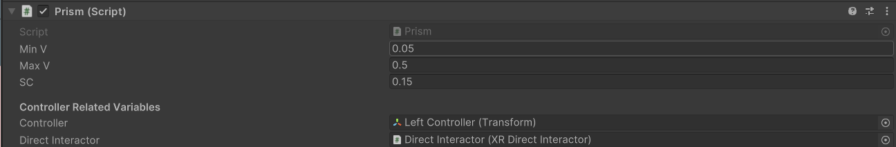
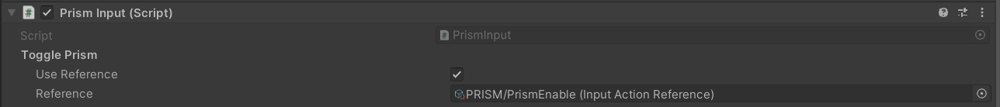
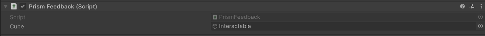
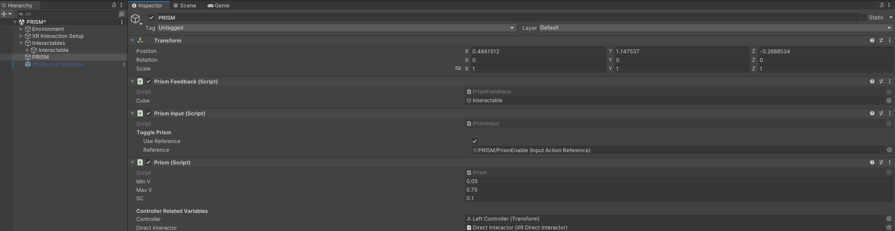

# cs5678_2024sp.h_prism.g03

 Video link: https://drive.google.com/file/d/1IM_X8uI8n7UkZag8wna679uaSeXMuhPv/view?usp=sharing

## Overview
This package is an implementation of the PRISM technique for object selection in VR. The package includes three components: PRISM Logic, PRISM Input, and PRISM Feedback. The PRISM Logic component handles the core logic of the PRISM technique, while the PRISM Input component handles user input and updates the PRISM Logic component accordingly. The PRISM Feedback component provides visual and auditory feedback for the PRISM technique.

## Components

### PRISM
This component implements the logic for the PRISM technique as presented in the original paper, with modifications as outlined below.

This package differs from the original paper in several ways, primarily due to the fact that the original technique was implemented using a offset recovery process which occurred over time, while this package implements offset recovery which is instantaneous.

| **Property** | **Description**                                                                                                                                                                |
|--------------|--------------------------------------------------------------------------------------------------------------------------------------------------------------------------------|
| **MinV**     | This is the minimum controller velocity which triggers the "still" state in the PRISM implementation.                                                                          |
| **MaxV**     | This is the maximum controller velocity which will trigger the PRISM technique to halt the current offset and return the selected object's motion to 1:1 with the user's hand. |
| **SC**      | This is the scaling factor which determines how much the selected object will move in relation to the user's hand.                                                             |
 | **Controller** | This is a reference to the controller's transform which is used to determine the velocity of the controller.                                                                 |
| **DirectInteractor** | This is a reference to the direct interactor which is used to determine the selected object.                                                                                   |

### PRISM Input 
Input component summary.

| **Property**     | **Description**                                                                         |
|------------------|-----------------------------------------------------------------------------------------|
| **Toggle Prism** | Input reference to the PRISM Enable input action (primary button on left XR controller) |

### PRISMFeedback
The Prism feedback 

| **Property** | **Description**                                                                     |
|--------------|-------------------------------------------------------------------------------------|
| **Cube**     | This is a reference to the selected cube object and used for line render endpoints. |

## Installation instructions
To install this package, follow these steps:
1. In the Unity Editor, click on **Window > Package Manager**
2. Click the + button and choose **Add package from git URL** option
3. Paste the URL to the package repository: https://github.com/cs5678-2024sp/h-prism-g-03.git in the prompt and click on **Add** 
4. If the repository is private, you will be asked to authenticate via your GitHub account. If you haven't been granted access to the repository you will not be able to install the package.
5. The package should be installed into your project
6. You can download the package samples from under the Samples tab in the Package Manager

Note: Even though the package documentation is public, several XRC packages are private and accessible only to XRC staff and students.

## Requirements
This package was developed and tested using the following Unity Editor version:

2022.4.7f1 LTS
Dependencies:
* XRC Core
* XR Interaction Toolkit
* Input System

## Workflow

Include a list of steps that the user can easily follow that demonstrates how to use the package. You can include screenshots to help describe how to use the feature.

## Samples

The sample folder includes a scene that demonstrates the PRISM technique in action. The scene includes a cube that can be selected using the PRISM technique. The sample scene has the same dependencies that are included in the documentation above.
